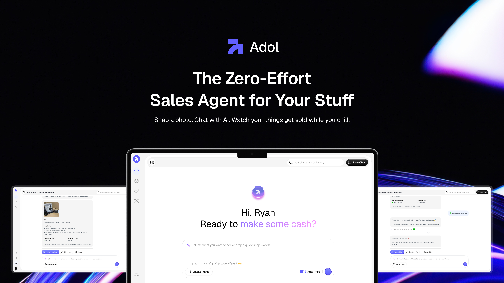

# 🌟 ADOL

<br />
<div align="center">
  <a href="https://github.com/Hackathon-Hunter/adol-website">
    
  </a>

  <h3 align="center">ADOL – The AI-Powered Marketplace for Web3 Commerce</h3>
<p align="center">
   ADOL is an innovative marketplace platform built fully on-chain and designed to work seamlessly on the Internet Computer blockchain. ADOL enables real-time product analysis, intelligent pricing, and automated listing generation across different marketplaces.

The platform provides a complete set of tools including an AI-powered image analysis engine, blockchain-based product management system, and community-driven marketplace insights. Users can analyze, create, and transact with greater confidence. Product listings are enhanced through AI models trained on high-quality market datasets, and results are continuously improved through community contributions and verified data. With built-in incentives and transparent pricing, ADOL empowers users to actively participate in building the future of Web3 commerce.

</p>

</div>

## � Why ADOL?

In the rapidly growing world of digital marketplaces, users struggle with creating compelling product listings, accurate pricing, and managing inventory across multiple platforms. Traditional listing tools are time-consuming, often produce suboptimal results, and lack intelligence to adapt to market conditions. ADOL addresses this challenge by providing an AI-powered platform that automatically analyzes product images, generates professional descriptions, and suggests optimal pricing strategies. Supporting cross-platform integration, ADOL enables users to create, manage, and optimize listings with confidence. Every product is analyzed before publication, giving users the best chance of successful sales as they navigate the competitive marketplace landscape.

## 🤖 AI-Powered Product Intelligence

ADOL's core intelligence layer is powered by advanced machine learning models that analyze product images and market data in real-time to generate optimal listings, pricing, and descriptions.

### Multi-Modal AI Analysis

- **Image Recognition**: Analyzes product photos to identify brand, model, condition, and features
- **Price Intelligence**: Examines market trends, condition assessment, and demand patterns
- **Content Generation**: Creates compelling descriptions optimized for marketplace algorithms

### Key AI Features

- **On-Chain Processing**: AI models integrated with Internet Computer canisters for trustless analysis
- **Computer Vision**: Advanced image analysis for product identification and condition assessment
- **Natural Language Processing**: Intelligent description generation and optimization
- **Market Intelligence**: Real-time price recommendations based on current market data

### Technical Highlights

| Component           | Technology                                    |
| ------------------- | --------------------------------------------- |
| **AI Framework**    | OpenAI GPT-4 via OpenRouter                   |
| **Computer Vision** | Advanced image analysis and recognition       |
| **Blockchain**      | Internet Computer (ICP) with Candid interface |
| **Agent Platform**  | Fetch.ai integration with Agentverse          |

The AI system processes multiple data points including product images, market conditions, brand recognition, and condition assessment to provide accurate listings with optimized conversion potential.

## 📚 Complete Resources

- **Live Application**: https://a7ovc-zyaaa-aaaap-qqcdq-cai.icp0.io/
- **Backend Dashboard**: https://dashboard.internetcomputer.org/canister/ujk5g-liaaa-aaaam-aeocq-cai
- **AI Agent**: https://agentverse.ai/agents/details/agent1qd2mu8zses2cxgd46wn9d79esn6u64juz00sg7w0qc5zsxa2v0fgs9c5a6w
- **Frontend Repository**: https://github.com/hunters-code/adol-website
- **Backend Repository**: https://github.com/hunters-code/adol-icp-backend
- **Agents Repository**: https://github.com/hunters-code/adol-agents

## 🌟 Features of ADOL

### ADOL AI Product Creator

- Upload product images and get instant AI-generated listings
- Automatic brand, model, and condition identification
- Intelligent price estimation based on market analysis
- Professional description generation optimized for sales
- Real-time market trend analysis and pricing recommendations

### ADOL Marketplace Dashboard

- Comprehensive product management interface
- Multi-status tracking (Active, Draft, Sold, Archived)
- Real-time analytics and performance insights
- Bulk operations for efficient catalog management
- Cross-platform listing synchronization

### AI-Powered Chat Assistant

- Interactive AI helper for listing optimization
- Natural language product detail modifications
- Market strategy recommendations and insights
- Real-time assistance for pricing and descriptions

### ADOL Product Analytics

- Advanced sales performance tracking
- Market demand forecasting and trend analysis
- Competitive pricing intelligence
- User engagement metrics and conversion optimization

### Blockchain-Based Asset Management

- Immutable product history and authenticity tracking
- Decentralized storage with Internet Computer integration
- Principal-based secure authentication via Internet Identity
- Smart contract automation for transactions and payments

### Indonesian Market Optimization

- Localized currency formatting (Indonesian Rupiah)
- Regional marketplace integration (Tokopedia, Shopee, etc.)
- Cultural and linguistic optimization for Indonesian users
- Local payment method support and preferences

## 🏆 What We Are Proud Of

- Successfully developed AI-powered image analysis engine providing instant product recognition and valuation
- Advanced language models deployed on Internet Computer for on-chain AI processing
- Seamless integration with Fetch.ai agents for autonomous marketplace operations
- Secure authentication with Internet Identity and principal-based user management
- Comprehensive product management system with real-time analytics and insights
- Localized experience optimized specifically for Indonesian marketplace ecosystem

## Build and Run Yourself

### Prerequisites

- [ ] Install [Node.js 18+](https://nodejs.org/) and npm package manager
- [ ] Get OpenRouter API key for AI features from [OpenRouter](https://openrouter.ai/)

Begin by opening a terminal window.

### Setup Application:

- **Clone the repository**

  ```bash
  git clone https://github.com/Hackathon-Hunter/adol-website.git
  cd adol-website
  ```

- **Install dependencies**

  ```bash
  npm install
  ```

- **Configure environment variables**

  ```bash
  cp .env.example .env.local
  # Edit .env.local with your OpenRouter API key
  ```

- **Start development server**

  ```bash
  npm run dev
  ```

- **Access the application**
  - Frontend: http://localhost:3000

## 🛣️ ADOL Roadmap

### 🧱 Phase 1 – AI Foundation & Core Platform

- Launch **AI-powered product analysis** with image recognition and price intelligence
- Develop and deploy **comprehensive marketplace dashboard** with product management
- Deploy **blockchain-based product storage** with immutable history tracking
- Integrate **Internet Identity authentication** for secure user management
- Release **Indonesian Rupiah localization** and regional marketplace optimization
- Launch **AI chat assistant** for interactive listing optimization

### 🌍 Phase 2 – Marketplace Expansion

- Develop **cross-platform mobile application** for iOS and Android
- Enable **multi-marketplace integration** (Tokopedia, Shopee, Facebook Marketplace, etc.)
- Add **bulk listing management** and **automated synchronization** across platforms
- Expand **AI capabilities** to support video analysis and 3D product modeling

### � Phase 3 – Advanced Commerce Features

- Launch **integrated payment processing** with cryptocurrency and fiat support
- Enable **escrow services** and **automated dispute resolution** via smart contracts
- Add **inventory management** with **supply chain tracking** and **authenticity verification**

### 🏛️ Phase 4 – Decentralized Governance & Ecosystem Growth

- Integrate ADOL into the **SNS (Service Nervous System)** for decentralized platform governance
- Begin development of **ADOL API/SDK** to allow third-party developers to access AI and marketplace tools
- Launch **ADOL token economy** with rewards for quality listings and community contributions

## 🏃‍♂️ Running Locally

### Quick Start (Frontend Development)

1. **Install Dependencies**

```bash
# Install all npm packages
npm install
```

2. **Configure Environment Variables**
   Create or update `.env.local`:

```env
NEXT_PUBLIC_OPENAI_API_KEY=your_openrouter_api_key_here
```

3. **Start Development Server**

```bash
# Start the Next.js development server
npm run dev
```

4. **Access the Application**

- **Frontend**: [http://localhost:3000](http://localhost:3000)

### Development Workflow

```bash
# Install dependencies
npm install

# Start development server with hot reload
npm run dev

# Build for production testing
npm run build

# Start production server locally
npm run start

# Lint code
npm run lint

# Type checking
npx tsc --noEmit
```

### Troubleshooting Local Setup

**Environment Variable Issues:**

```bash
# Verify environment variables are loaded
npm run dev
# Check browser console for any "undefined" API key errors
```

**Next.js Build Issues:**

```bash
# Clear Next.js cache
rm -rf .next
npm run build

# Clear node modules if needed
rm -rf node_modules package-lock.json
npm install
```

### Local Testing Checklist

- [ ] Frontend development server is running on port 3000
- [ ] Environment variables are configured correctly
- [ ] AI features work (if OpenRouter API key is configured)
- [ ] Can navigate through all pages and components
- [ ] UI components render correctly

### Performance Tips

- Use `npm run dev` for faster development with hot reload
- Use browser dev tools to debug API calls and state management
- Monitor console for any JavaScript errors or warnings

## 🚀 Deployment

### Local Development

```bash
npm run dev
```

### Production Build

```bash
npm run build
npm run start
```

### Internet Computer Deployment

```bash
# Build the frontend
npm run build

# Deploy to IC mainnet
dfx deploy --network ic --no-wallet
```

The application will be available at: `https://[canister-id].icp0.io/`

## 📱 Usage Guide

### Getting Started

1. **Connect Wallet**: Use Internet Identity to authenticate
2. **Upload Product Image**: Take or upload a photo of your item
3. **AI Analysis**: Let AI analyze and create your listing
4. **Review & Edit**: Modify details as needed
5. **Publish**: Make your product live on the marketplace

### AI Features

- **Image Upload**: Drag & drop or click to upload product photos
- **Smart Analysis**: AI examines condition, brand, model, and market value
- **Price Suggestions**: Automatic listing, target, and minimum price recommendations
- **Chat Assistance**: Ask AI to modify descriptions, prices, or other details

### Product Management

- **Dashboard**: View all your products in one place
- **Status Filtering**: Filter by Active, Draft, or Sold items
- **Edit Listings**: Update product information anytime
- **Analytics**: Track views, likes, and engagement (coming soon)

## 🔧 Configuration

### Environment Variables

| Variable                     | Description                        | Required |
| ---------------------------- | ---------------------------------- | -------- |
| `NEXT_PUBLIC_OPENAI_API_KEY` | OpenRouter API key for AI features | Yes      |

### Canister Configuration

The project is designed to work with backend services deployed on the Internet Computer, but for frontend development you only need to run the Next.js application locally.

## 🧪 Development

### Project Structure

```
src/
├── app/                    # Next.js app router pages
│   ├── auth/              # Authentication pages
│   ├── dashboard/         # User dashboard
│   ├── home/              # AI product creation
│   ├── messages/          # AI agent communication
│   ├── products/          # Product management
│   └── layout/            # Shared layouts
├── components/            # Reusable UI components
│   ├── ui/                # Basic UI elements
│   └── providers/         # Context providers
├── hooks/                 # Custom React hooks
├── service/              # API and business logic
│   ├── api/              # Service layers
│   └── declarations/     # Generated canister types
└── utils/                # Utility functions
```

### Key Features Implementation

#### AI Image Analysis

- Upload handling with drag & drop
- Image optimization and compression
- Base64 encoding for AI processing
- Intelligent prompt engineering for marketplace listings

#### Blockchain Integration

- Internet Identity authentication
- Principal-based user management
- Candid interface for type safety
- Real-time canister communication

#### Currency Formatting

- Indonesian Rupiah localization
- Thousand separator formatting
- Consistent price display across all components

## 🤝 Contributing

1. Fork the repository
2. Create a feature branch (`git checkout -b feature/amazing-feature`)
3. Commit your changes (`git commit -m 'Add amazing feature'`)
4. Push to the branch (`git push origin feature/amazing-feature`)
5. Open a Pull Request

## 📄 License

This project is licensed under the MIT License - see the [LICENSE](LICENSE) file for details.

## 🔗 Links

### 🌐 Live Application

- **Live Demo**: [https://a7ovc-zyaaa-aaaap-qqcdq-cai.icp0.io/](https://a7ovc-zyaaa-aaaap-qqcdq-cai.icp0.io/)
- **Backend ICP Dashboard**: [https://dashboard.internetcomputer.org/canister/ujk5g-liaaa-aaaam-aeocq-cai](https://dashboard.internetcomputer.org/canister/ujk5g-liaaa-aaaam-aeocq-cai)

### 🤖 AI Framework

- **Core Engine**: Fetch.ai integration
- **Deployment Platform**: Agentverse
- **Agent Address**: `test-agent://agent1qd2mu8zses2cxgd46wn9d79esn6u64juz00sg7w0qc5zsxa2v0fgs9c5a6w`
- **Capabilities**: Computer vision, natural language processing, autonomous negotiation
- **Agentverse URL**: [https://agentverse.ai/agents/details/agent1qd2mu8zses2cxgd46wn9d79esn6u64juz00sg7w0qc5zsxa2v0fgs9c5a6w](https://agentverse.ai/agents/details/agent1qd2mu8zses2cxgd46wn9d79esn6u64juz00sg7w0qc5zsxa2v0fgs9c5a6w)

### 💻 Technical Stack

- **Frontend Repository**: [https://github.com/hunters-code/adol-website](https://github.com/hunters-code/adol-website)
- **Backend Repository**: [https://github.com/hunters-code/adol-icp-backend](https://github.com/hunters-code/adol-icp-backend)
- **Agents Repository**: [https://github.com/hunters-code/adol-agents](https://github.com/hunters-code/adol-agents)

### 📚 Documentation & Resources

- **Repository**: [https://github.com/hunters-code/adol-website](https://github.com/hunters-code/adol-website)
- **Internet Computer**: [https://internetcomputer.org/](https://internetcomputer.org/)
- **Next.js**: [https://nextjs.org/](https://nextjs.org/)
- **Fetch.ai**: [https://fetch.ai/](https://fetch.ai/)

## 📞 Support

For support, email support@adol.com or join our community discussions.

---

Built with ❤️ using Internet Computer, Next.js, and FetchAi
